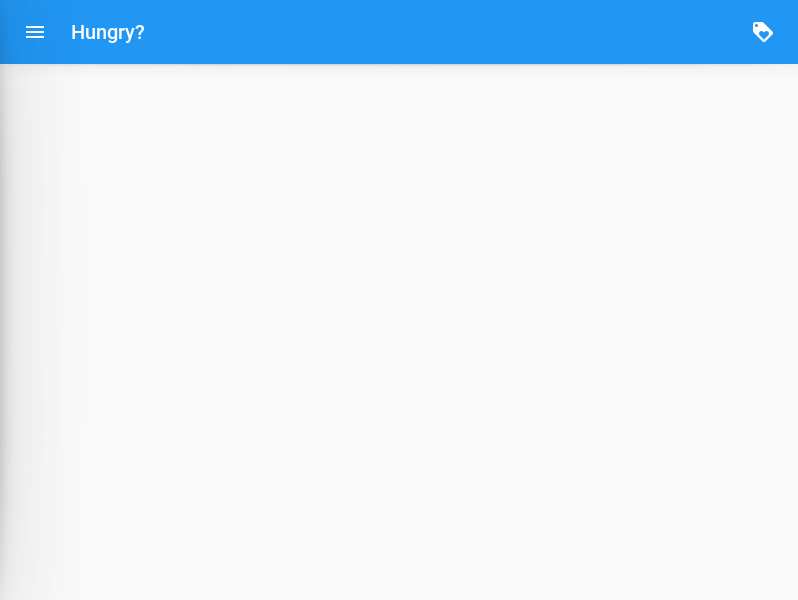
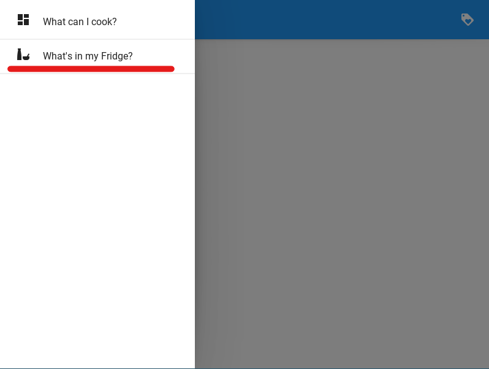
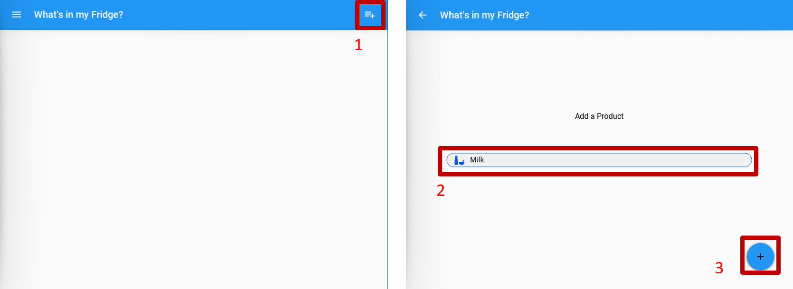
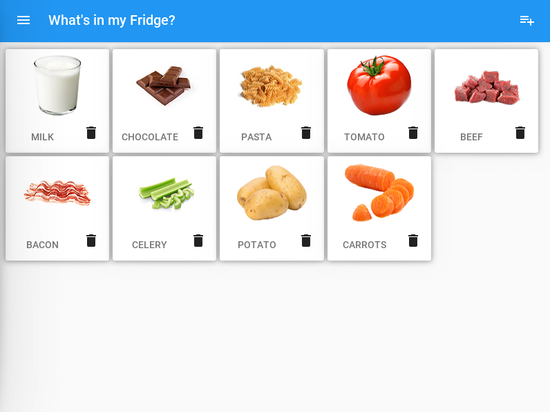
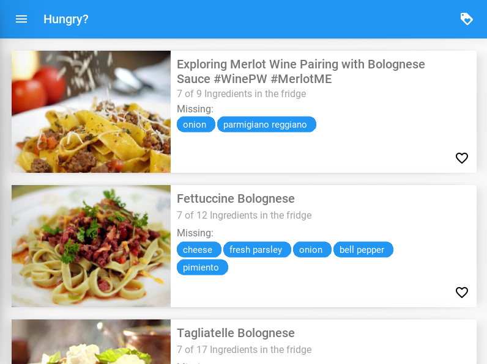
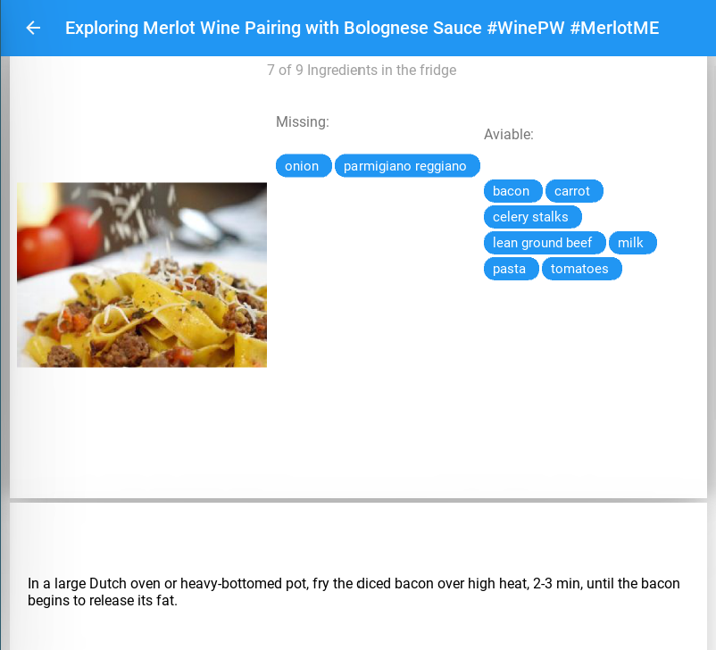
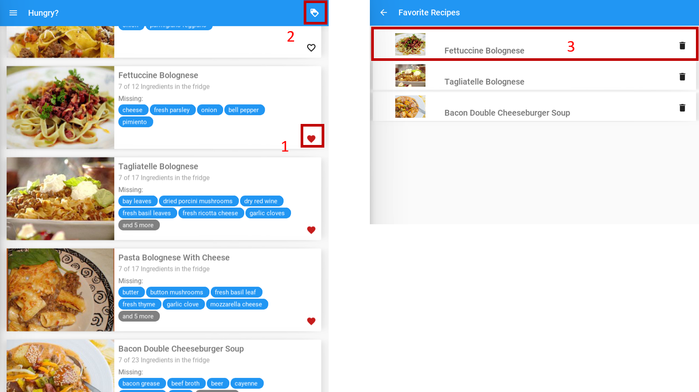

# What's in my Fridge

An App where you can add the ingredients in your fridge and it will recommend what can you prepare with those.


## IT Talents Competition
This App was made for the [Code Competition for October 2020](https://www.it-talents.de/foerderung/code-competition/code-competition-10-2020-edeka-digital) from [IT-Talents.de](https://www.it-talents.de/)

### Features

#### Basic Features

- Input option / reading in of existing Ingredients
- Suggestions of recipes that can be cooked with the entered ingredients
- Show the recipe preparation
- Saving of the Ingredients and recipes in a SQL Database (Offline)

#### Extra Features
- the user can favorite recipes and save them for later
- A beautiful UI 
- The Recipes and ingredients have an asociated image 

#### What can be better?
- Better UX for the Recipe Steps
- Working out of the main thread ( a more responsive UI)
- Social Sharing
- Cloud Database
- User Management

## Set Up

The following steps will guide you through setting up all the necessary dependencies to test the code.

First you will need to clone the repository. Then open a terminal and change the working directory to the repository

### Python and Dependencies

to use the code you will need a python installation, i would strongly recommend using [Python 3.7.9](https://www.python.org/downloads/release/python-379/).

1. Install python on your system and create a new virtual enviroment using Python virtualenv in the repository folder

```bash
python -m pip install --upgrade pip wheel setuptools virtualenv

python -m virtualenv whatsonmyfridge_venv
```

2. Activate the Enviroment
```bash
whatsonmyfridge_venv\Scripts\activate
```
if you're in a bash terminal, instead do:
```bash
source whatsonmyfridge_venv/Scripts/activate
```
Your terminal should now preface the path with something like ```(whatsonmyfridge_venv)```, indicating that the whatsonmyfridge_venv environment is active. 

3. Install the necessary dependencies

Using the file ```requirements.txt``` in the repository, install the required dependencies:

```bash
python -m pip install -r requirements.txt
```

4. Make a fix on the Kivy installation

sadly the actual version of kivy has a little bug that will not allow us to load the images correctly, to fix this open the ```loader.py``` in the virtual enviroment

```
whatsonmyfridge_venv\Lib\site-packages\kivy\loader.py
```
and change the following block (aprox line 334):
```python
#...
if (
    Config.has_section('network')
    and 'useragent' in Config.items('network')
):
#...
```
to:
```python
#...
if Config.has_option('network', 'useragent'):
#...
```

this should solve the problem.

### Recipe API

if you are accessing this from the competition Application you can use the APIKey that i provided with the project, if not you need to get your own API key from [Spoonacular](https://spoonacular.com/food-api/console#Profile)

after getting your Spoonacular APIKey, you will need to set an enviroment variable

- in linux:
```bash
export API_KEY_SPOONACULAR="1234YOURAPIKEY890"
```
- in windows:

add the following to the file ```whatsonmyfridge_venv\Scripts\activate.bat``` in your virtual enviroment:
```bash
set "API_KEY_SPOONACULAR=1234YOURAPIKEY890"
```

Do not forget to reactivate the enviroment:

```bash
whatsonmyfridge_venv\Scripts\activate
```
if you're in a bash terminal, instead do:
```bash
source whatsonmyfridge_venv/Scripts/activate
```

Now our are all set!

## Running the Script

make sure that the enviroment is acivated (Your terminal should now preface the path with something like ```(whatsonmyfridge_venv)```). and make sure that the ```API_KEY_SPOONACULAR``` is set up (you can use ```echo $API_KEY_SPOONACULAR``` in linux or ```echo %API_KEY_SPOONACULAR%``` in Windows).

then run the main.py file using python

```bash
python main.py
```

# How To use


## Starting Up
after starting the Script you will see the following:



This is the dashboard, right now it is empty. this is because our "Fridge" is empty.

let's add something to it, to do this, open the menu on the top-left, and choose "What's in my Fridge?"




## Adding Ingredients

use the button on the top-right to add an Ingredient. (**Right now the app only support English!**)



Try adding multiple Ingredients, so we can get interesting recommendations



## The Dashboard

navigate back to the Dashboard, after a couple of seconds you should be getting around 10 recommendations. this will show the image (if exist), a summary of hoy many ingredients you still need to get, and the list of missing ingredients.



if you click on a recipe, you will get an overview of the required ingredients and the detailed steps to cook it!



## Saving Recipes

if you loved a recipe, or just want so save it for later, you can click on the little heart in the dashboard to save the recipe in your favorites, you can then access them by clicking in the top right button
